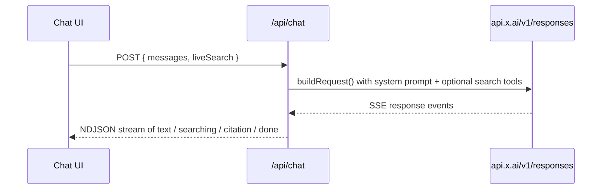

# Fantasy GM

A single-page chat app for fantasy football questions, answered by xAI's Grok. Ask start/sit, waiver, and trade questions all season; flip on Live Search when you need current injury news and beat reports instead of the model's training data.

## Quick start

```bash
cd fantasy-gm
pnpm install
cp .env.example .env.local   # then paste your key from https://console.x.ai
pnpm dev
```

Open http://localhost:3000. If `XAI_API_KEY` is missing, the app loads and tells you so rather than failing silently.

## Configuration

| Variable       | Required | Default              | Purpose                                          |
| -------------- | -------- | -------------------- | ------------------------------------------------ |
| `XAI_API_KEY`  | Yes      | —                    | xAI API key. Read only on the server.            |
| `GROK_MODEL`   | No       | `grok-4.6`           | Override when xAI retires or renames a model.    |
| `XAI_BASE_URL` | No       | `https://api.x.ai/v1`| Point at a proxy or gateway instead of xAI.       |

The key never reaches the browser: the UI talks to `/api/chat`, which holds the credential and streams tokens back.

## Live Search

The header toggle controls whether Grok can search while answering.

- **On** — the request includes the `web_search` and `x_search` agentic tools, the prompt tells Grok to prefer current reporting for anything time-sensitive, and answers come back with source links. Search tool calls are billed per call by xAI on top of tokens.
- **Off** — no tools, model knowledge only. Faster and cheaper, fine for rules, strategy, and roster-construction questions.

Worth knowing if you have seen older xAI examples: Live Search used to be a `search_parameters` object on `/v1/chat/completions`. xAI retired that on 2026-01-12 and it now returns HTTP 410. This app uses the Responses API (`/v1/responses`) with search as tools, which is the supported path.

## How it works



Two translation steps do the real work, and both are pure functions with tests:

- `toStreamEvents()` in [lib/grok.ts](lib/grok.ts) reduces xAI's event vocabulary to five UI events. Unrecognized event types map to nothing, so new xAI event kinds are ignored rather than breaking a stream.
- `createEventParser()` in [lib/protocol.ts](lib/protocol.ts) reassembles those events in the browser, tolerating chunk boundaries that split a line.

`lib/protocol.ts` is deliberately free of any SDK import so the client bundle does not pull in the xAI SDK.

## Layout

```
fantasy-gm/
├── app/
│   ├── api/chat/route.ts    ← streaming proxy; holds XAI_API_KEY
│   ├── globals.css          ← turf/chalk theme + markdown answer styles
│   └── page.tsx
├── components/
│   ├── answer.tsx           ← markdown answer, search indicator, citations
│   ├── chat.tsx             ← transcript, composer, streaming state
│   └── live-search-toggle.tsx
└── lib/
    ├── grok.ts              ← xAI client, request building, event mapping
    ├── messages.ts          ← transcript reducers
    ├── prompt.ts            ← system prompt + suggested questions
    └── protocol.ts          ← wire types, NDJSON encode/parse
```

## Tests

```bash
pnpm test        # vitest, 69 specs
pnpm lint
pnpm typecheck
```

Nothing in the suite touches the network. `lib/grok.test.ts` builds a real `OpenAI` client against a fake `fetch` that serves a recorded SSE body, so the request shape, the SDK's SSE decoding, and the event mapping are all exercised end to end offline.

## Editing the analyst's behavior

Both prompts live in [lib/prompt.ts](lib/prompt.ts). `SYSTEM_PROMPT` sets the default scoring assumption (standard PPR redraft) and the house style of committing to one recommendation instead of hedging. `LIVE_SEARCH_PROMPT` is appended only when the toggle is on and covers source preference and recency. `SUGGESTED_QUESTIONS` feeds the empty-state chips.
